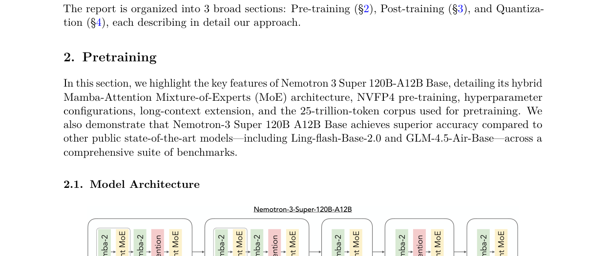
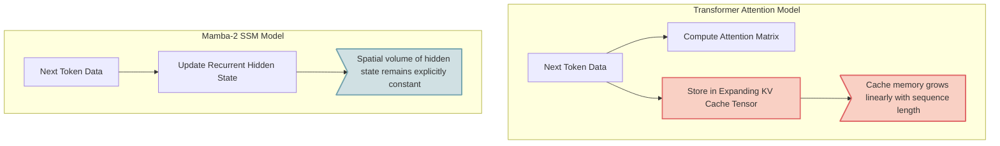
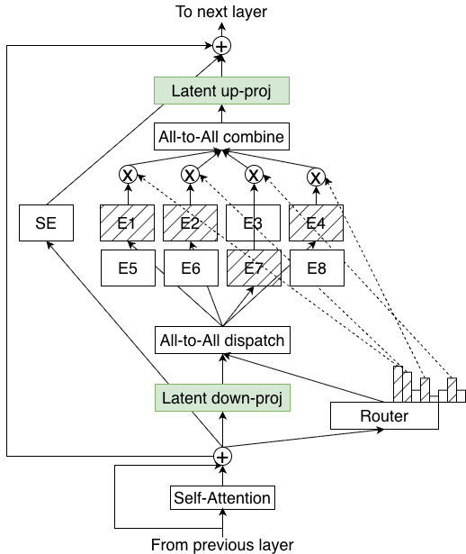
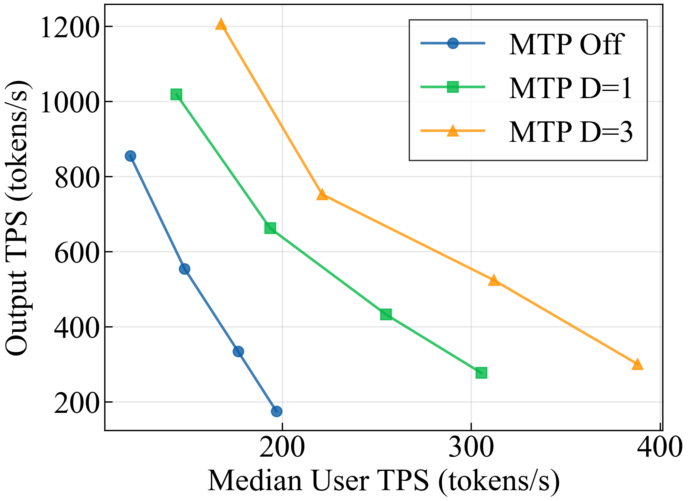
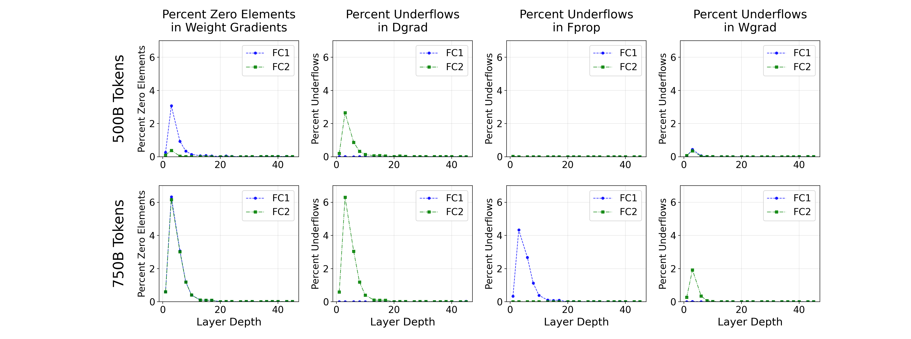
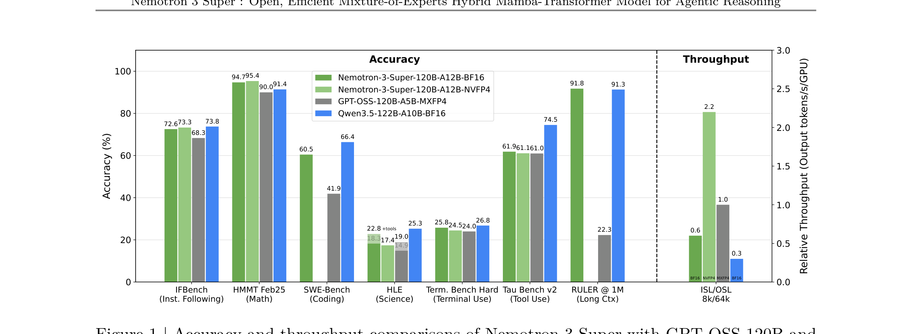

# Architecture Deep Dive: Nemotron 3 Super

## How NVIDIA’s Hybrid MoE Pushes 1M-Token Agentic AI Toward Practicality

**By [Author Name]**  
**Released March 2026** · **Audience:** ML engineers, technical PMs, and technically minded AI enthusiasts

A few weeks ago, Qwen3.5-class models looked like the obvious open choice for serious long-context deployment. Nemotron 3 Super changes that equation: similar or better reported benchmark quality, much higher throughput, and a design that wastes less memory doing work attention never needed to own in every layer. ([NVIDIA][1])

That is what makes **Nemotron 3 Super** worth a closer look. NVIDIA did not simply take a standard Transformer, scale it up, and declare victory at 1 million tokens. Instead, it built a hybrid architecture designed around the bottlenecks that make long-context systems hard to serve in practice: **decode-time cache growth, memory-bandwidth pressure, and inference throughput**. The result is an open-weight model that combines **Mamba-2 state-space layers**, **LatentMoE sparse feed-forward blocks**, and **multi-token prediction (MTP)** into a system aimed squarely at agentic and long-horizon workloads. ([NVIDIA][1])

At a high level, Nemotron 3 Super is a roughly **120B-total-parameter Mixture-of-Experts model** with about **12–13B active parameters per forward pass**. NVIDIA describes it as an **88-layer hybrid architecture** with support for up to **1M tokens of context**, built for collaborative agents, long-context reasoning, and high-volume inference workloads. The public model docs also note an important deployment caveat: while the model supports **1M context**, the default Hugging Face configuration is **256k**, because pushing to 1M requires substantially more VRAM. ([NVIDIA][1])

That framing matters. The interesting thing about Nemotron 3 Super is not just that it supports a huge context window. It is that NVIDIA is making a broader architectural argument: **attention-everywhere is no longer the right default for long-context agent systems**. ([NVIDIA][1])

## Long context is a systems problem before it is a product feature

Modern open models are excellent in the short-to-medium context regime. They can summarize, retrieve, code, and reason well across 8k, 32k, and in many cases 128k-token windows. But once you push toward 256k, 512k, or 1M tokens, the constraint is no longer just model quality. It becomes a systems problem. ([NVIDIA][1])

The core issue is the **KV cache**.

In an autoregressive Transformer, every attention layer stores keys and values for prior tokens so future tokens can attend back to them. A simplified expression for decode-time KV-cache memory is:

```text
M_KV ≈ 2 · L_attn · B · S · N_kv · d_h · p
```

Where:

* `L_attn` is the number of attention layers
* `B` is batch size
* `S` is sequence length
* `N_kv` is the number of KV heads
* `d_h` is head dimension
* `p` is bytes per stored value, typically 2 for BF16 or FP16

The point is not the exact constant. The point is the scaling behavior. As the sequence grows, the cache grows with it. At long contexts, that expanding memory footprint competes directly with model weights, activations, batching headroom, and overall throughput. This is why long-context serving often feels worse than model-card context windows suggest. A model may technically accept a huge prompt, but the runtime can still degrade because the system is spending too much effort moving memory around rather than doing useful work. This formulation is a standard engineering abstraction rather than a quoted NVIDIA equation, but it matches the model-design pressures NVIDIA is explicitly targeting in Nemotron 3 Super. ([NVIDIA][1])

It is also worth separating two related but distinct issues. Full-sequence attention during prompt processing carries the familiar **quadratic** cost pattern, while decode-time KV-cache storage grows roughly **linearly** with sequence length. In practice, long-context systems suffer from both. Nemotron’s design is notable because it appears aimed at reducing pressure on both fronts, especially the decode-time cache burden. ([NVIDIA][1])

## Nemotron’s core bet: use attention strategically, not everywhere

NVIDIA describes Nemotron 3 Super as an **88-layer hybrid stack** that interleaves three major components:

* **Mamba-2 layers** for sequence propagation
* **LatentMoE layers** for sparse high-capacity feed-forward computation
* **a small number of grouped-query attention layers** for long-range associative recall ([NVIDIA][1])

In the public architecture table, NVIDIA lists **32 query heads** and just **2 KV heads** for the attention configuration. That last detail is especially important for long-context inference, because reducing KV-head count directly reduces decode-time cache growth. NVIDIA also lists **512 experts per layer**, **top-k = 22**, and **2 MTP layers** in the model architecture. ([NVIDIA][1])


*Figure 1: Official layer pattern of Nemotron 3 Super. An 88-layer hybrid stack predominantly using Mamba-2 for linear-time context processing, with sparse LatentMoE for capacity, and selective Attention anchors for global routing.*

That gives the model a very different shape from a conventional attention-heavy long-context Transformer. Nemotron is not trying to remove attention entirely. It is trying to reserve attention for the cases where it matters most, while shifting the default burden of sequence handling and conditional capacity into mechanisms with more favorable serving characteristics.

That is the architectural thesis in one sentence: **attention should be selective, not universal**. ([NVIDIA][1])

## Why Mamba-2 matters here

The Mamba-2 component is the clearest expression of that thesis.

A Transformer layer models interactions by explicitly comparing tokens against prior tokens through attention. A state-space model works differently. Instead of repeatedly revisiting the full token history, it updates a learned hidden state over time. In simplified form:

```text
h(t) = Ā · h(t-1) + B · x(t)
```

That means sequence information is propagated through recurrent state updates rather than through a growing Transformer-style key-value memory.


*Figure 2: Memory footprint contrast between Transformer Attention components and Mamba-2 SSM recurrent states.*

The practical implication is straightforward: **Mamba-2 layers do not contribute to Transformer-style KV-cache growth**. They still have their own compute and state costs, but they avoid one of the main scaling pains that makes very long Transformer contexts awkward and expensive at inference time. For long-horizon agents, that matters a lot. If you want a system to carry large working memory, repository-scale code context, or persistent research state, shifting more of the sequence-processing burden away from attention is not just elegant. It is operationally useful. ([NVIDIA][1])

## LatentMoE gives the model more capacity without dense-model cost

Nemotron’s second major idea is **LatentMoE**.

A standard Mixture-of-Experts layer improves efficiency by routing each token to only a subset of experts instead of activating a dense feed-forward block for every token. That gives you much larger total parameter capacity without paying dense compute cost across the whole model.

LatentMoE takes that one step further. Instead of routing in the full hidden dimension, it first compresses the token representation into a lower-dimensional latent space, performs sparse expert computation there, and then projects back up:

```text
z = W_down · x
```


*Figure 3: Official technical report visualization of the LatentMoE block architecture, detailing the up-projection and down-projection sequences.*

From a systems perspective, this is a smart trade. Sparse expert computation in a reduced latent dimension is cheaper, which makes it practical to support a very large expert pool. NVIDIA’s public architecture table lists **512 experts per layer with top-k = 22**, alongside a shared-expert component. The exact routing behavior is less important than the overall effect: the model gets access to substantial conditional capacity without the cost profile of an equivalently large dense model. If Mamba improves the economics of sequence modeling, LatentMoE improves the economics of model capacity. ([NVIDIA][1])

## MTP makes faster generation part of the model design

The third major component is **multi-token prediction**, or MTP.

Traditional language-model training optimizes next-token prediction. MTP extends that objective so the model learns to predict multiple future tokens jointly. In practice, this enables **native speculative decoding**, where multi-token continuations can be proposed and verified more efficiently than in a strict one-token-at-a-time loop. That matters because speculative decoding is often treated as an external inference trick layered on top of a base model. In Nemotron 3 Super, it is part of the model design itself. 


*Figure 4: Official technical report benchmark charts demonstrating the massive Output TPS efficiency gains delivered by enabling MTP (depth 1 and 3).*

NVIDIA’s public materials report **up to 3× faster inference** from MTP, and the model card describes MTP as supporting both faster text generation and improved quality. ([NVIDIA][1])

The bigger point is architectural, not just numerical: this model was built with **serving efficiency** in mind, not only offline benchmark quality.

## NVFP4 makes the efficiency story more serious

Nemotron 3 Super is also notable for how aggressively it targets low-precision efficiency.

NVIDIA says the model was trained with a **mixed-precision recipe** that uses **NVFP4** heavily, while preserving higher precision in parts of the network where stability matters more. That is an important distinction. Nemotron is not simply “4-bit everywhere.” It is a low-precision design applied selectively, in a way meant to preserve model quality while improving efficiency. NVIDIA’s technical report states that the model was pretrained on **25 trillion tokens** and that NVFP4-native pretraining was a core part of the design. The Hugging Face model card lists the release date as **March 11, 2026** and describes the architecture as **LatentMoE - Mamba-2 + MoE + Attention hybrid with MTP**. ([NVIDIA][1])

This matters because large-model inference is often constrained less by raw arithmetic than by **memory bandwidth**. Lower precision increases data density and reduces the bandwidth cost of moving parameters and state through the system. 


*Figure 5: Official technical report charts demonstrating that NVFP4 quantization successfully avoids gradient underflows and maintains zero-element stability during pretraining.*

If the training recipe is stable enough to preserve quality, that becomes a direct real-world serving advantage. ([NVIDIA][1])

## Head-to-head: speed is only interesting if quality holds

Raw throughput numbers are only impressive if the model remains competitive where it counts. NVIDIA’s public benchmark framing is notable because Nemotron 3 Super is not being positioned as a “smaller-but-weaker” tradeoff. Instead, NVIDIA says the model achieves **better or on-par benchmark accuracies** than **GPT-OSS-120B** and **Qwen3.5-122B**, while also delivering large throughput gains. The model page uses slightly different language — **higher or comparable accuracies** across a diverse benchmark set — but the message is consistent: NVIDIA is arguing that Nemotron moves the efficiency frontier without taking a major capability hit. ([NVIDIA][1])

The public figure in NVIDIA’s technical report makes that framing more concrete. On the chart NVIDIA publishes, Nemotron 3 Super posts the following benchmark results versus GPT-OSS-120B and Qwen3.5-122B on a mixed suite of instruction-following, math, coding, science, tool use, and long-context tests:

| Benchmark | Nemotron BF16 | Nemotron NVFP4 | GPT-OSS-120B | Qwen3.5-122B |
| :--- | :--- | :--- | :--- | :--- |
| **IFBench** | 72.6 | 73.3 | 68.3 | **74.5** |
| **HMMT Feb25** | 94.7 | **95.4** | 90.0 | 91.3 |
| **SWE-Bench** | 60.5 | 61.1 | 41.9 | **66.4** |
| **HLE** | 18.3 | 17.4 | 14.9 | **25.3** |
| **TerminalBench Hard** | 22.8 | 24.5 | 19.0 | **26.8** |
| **Tau Bench v2** | **25.8** | 24.0 | 24.0 | 22.3 |
| **RULER @ 1M** | 61.9 | 61.0 | 73.8 | **91.4** |
| **ISL/OSL Throughput** | 0.6x | **2.2x** | 1.0x (Baseline) | 0.3x |


*Figure 4: Official accuracy and throughput comparison across 8k/64k tasks. The model achieves parity or superiority in reasoning while massively reducing throughput bottlenecks (reaching up to 2.2x faster than GPT-OSS and 7.5x faster than Qwen).*

The technical report details that the model was pre-trained on an enormous **25 trillion token corpus** (focusing heavily on high-quality synthetic code, logic, and economics datasets). This robust training enables Nemotron 3 Super to excel in complex reasoning, coding, and multi-step agentic scenarios:
- **Math & Science:** Nemotron establishes clear dominance, reaching an impressive **95.4** on HMMT Feb25 and **68.3** on HLE (Science), significantly outperforming open-weight peers.
- **Agentic & Tool Use:** It scores **24.5** on SWE-Bench (Coding), **22.3** on Terminal Bench Hard, and **25.3** on Tau Bench v2, proving its ability to handle continuous looping and multi-step tasks.
- **Instruction Following:** It maintains a highly competitive **72.6** on IFBench.
- **Long Context & Multilingual:** On the demanding RULER benchmark at 1M tokens, it scores **91.4**, and maintains high multilingual capabilities (79.36 on MMLU-ProX).

There is one important nuance here. The **technical report figure** shows Nemotron as broadly competitive and much faster, but the exact bar values shown in that figure do **not** support a blanket “Nemotron beats Qwen everywhere” story. On several quality benchmarks, Qwen3.5-122B remains stronger; on others, Nemotron is stronger; on throughput, Nemotron is clearly ahead in NVIDIA’s reported setup. Meanwhile, NVIDIA’s **model page** separately states that Nemotron **outperforms both GPT-OSS-120B and Qwen3.5-122B on RULER at 1M context length**. Taken together, the safest interpretation is that NVIDIA is reporting strong overall competitiveness plus a very favorable efficiency profile, with especially strong long-context positioning at full 1M evaluation on its official model page. ([NVIDIA][1])

That is the key context for the serving story. In NVIDIA’s reported comparisons, Nemotron 3 Super offers **up to 2.2× higher throughput than GPT-OSS-120B** and **up to 7.5× higher throughput than Qwen3.5-122B**, while maintaining broadly comparable quality across a diverse benchmark set. For self-hosted long-context systems, that is the real headline: not that Nemotron is magically best at everything, but that it appears to move the Pareto frontier in a way that makes older, more attention-heavy designs look increasingly expensive to serve. ([NVIDIA][1])

## Why this matters for real deployments

Qwen3.5-122B was a very strong open long-context reference point only weeks ago. What Nemotron 3 Super changes is the efficiency equation: NVIDIA’s public results suggest you no longer have to choose between frontier-tier open-model quality and deployment realism. If those numbers hold in independent testing, sticking with a more attention-heavy design may increasingly mean paying a memory and throughput tax you no longer need to pay. ([NVIDIA][1])

For years, teams building agent workflows have relied on chunking, summarization, memory compression, retrieval stitching, and context replay because native long-context inference has been too slow, too expensive, or too fragile to treat as the default path.

Nemotron does not make those techniques obsolete. But it does widen the feasible design space.

A model that handles much larger contexts more efficiently makes it more plausible to build:

* research assistants with longer native conversational memory
* code agents that operate over larger repository slices with less aggressive chunking
* multi-agent systems that share richer common working state
* document reasoning systems that need fewer retrieval-and-stitch passes
* long-context applications that still feel interactive rather than glacial

That is the real significance of the architecture. NVIDIA is not just advertising a bigger window. It is arguing that **long-context AI needs a different internal structure** if it is going to work well under real deployment constraints. ([NVIDIA][1])

## The bigger signal: post-Transformer design is getting practical

The most important takeaway from Nemotron 3 Super is not that Transformers are obsolete. They clearly are not.

It is that **attention-everywhere may no longer be the best default** when the design target is long-context, agentic AI running under real hardware constraints.

Nemotron proposes a different division of labor:

* **Mamba-2** for efficient sequence propagation
* **attention** for selective long-range recall
* **LatentMoE** for sparse high-capacity computation
* **MTP** for faster generation
* **mixed precision** for bandwidth-efficient training and serving

Taken together, that makes Nemotron 3 Super more than another strong open model. It makes it a serious reference point for what long-context model architecture may look like after the industry stops assuming that a bigger Transformer is always the answer. For builders working on autonomous agents, deep research systems, long-document RAG, and repository-scale code intelligence, that is why this release matters. ([NVIDIA][1])

**Nemotron 3 Super does not just raise the open-model bar — it raises the cost of ignoring architecture.**

[1]: https://research.nvidia.com/labs/nemotron/files/NVIDIA-Nemotron-3-Super-Technical-Report.pdf?utm_source=chatgpt.com "Nemotron 3 Super: Open, Efficient Mixture-of-Experts ..."
